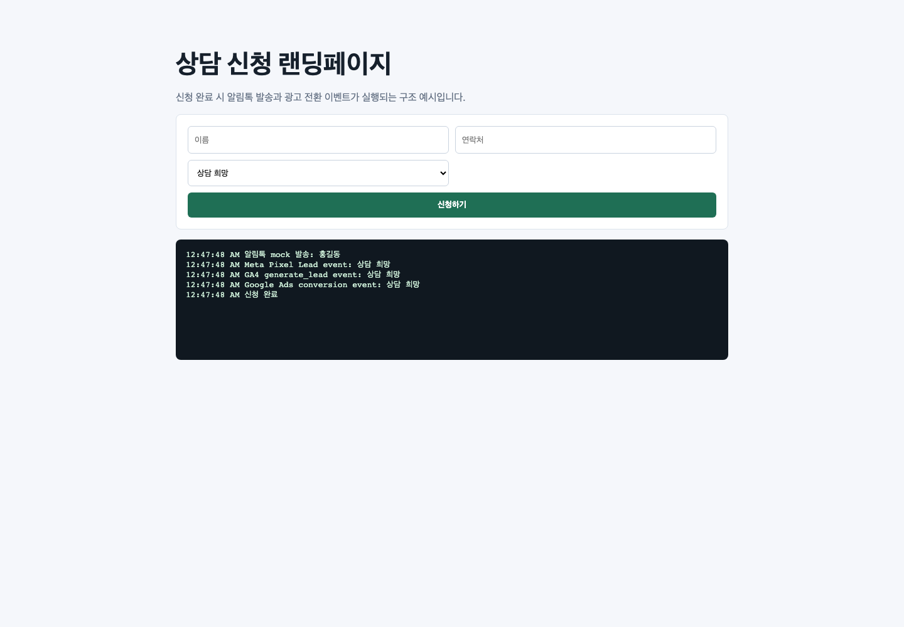

# Landing Tracking Alimtalk Demo

랜딩페이지 신청 폼 제출 이후 알림톡 발송과 광고 전환 이벤트가 실행되는 CRM/마케팅 연동 데모입니다. 실제 API 키 없이 mock 함수로 동작하며, 전환 이벤트 실행 시점과 처리 로그를 화면에서 확인할 수 있습니다.



## Portfolio Summary

- 업무 범위: 신청 폼 UI, 알림톡 API 호출 구조, 광고 전환 추적 이벤트, 처리 로그
- 적용 분야: 랜딩페이지, CRM, 마케팅 자동화, 광고 성과 측정
- 포트폴리오 상세: [PORTFOLIO.md](./PORTFOLIO.md)

## 문제 상황

광고 랜딩페이지에서는 폼 제출 버튼 클릭이 아니라 고객 정보 저장이 완료된 시점을 기준으로 전환 이벤트를 잡아야 중복 전환과 누락을 줄일 수 있습니다. 이 데모는 신청 폼 제출 후 알림톡 발송과 Meta Pixel, GA4, Google Ads 전환 이벤트가 순차 실행되는 구조를 가정했습니다.

## 주요 기능

- 신청자 이름, 연락처, 문의 유형 입력 폼
- 제출 완료 후 알림톡 mock 발송
- Meta Pixel, GA4, Google Ads 전환 이벤트 mock 실행
- 성공/실패 처리 로그 표시
- 중복 전환 방지를 고려한 완료 시점 분리

## 기술 스택

- HTML
- CSS
- JavaScript
- 카카오 알림톡 API 확장 가능 구조
- Meta Pixel/GA4/Google Ads 전환 추적 확장 가능 구조

## 실행 방법

```bash
python3 -m http.server 5176
```

브라우저에서 `http://localhost:5176`으로 접속합니다.

## 실서비스 확장 방향

- 카카오 알림톡 API 또는 발송 대행사 API 연동
- CRM 저장 완료 이벤트와 알림톡 트리거 연결
- Meta Pixel Lead 이벤트와 GA4 `generate_lead` 이벤트 적용
- Google Ads 전환 스니펫 적용
- 실패 로그 및 재발송 관리
